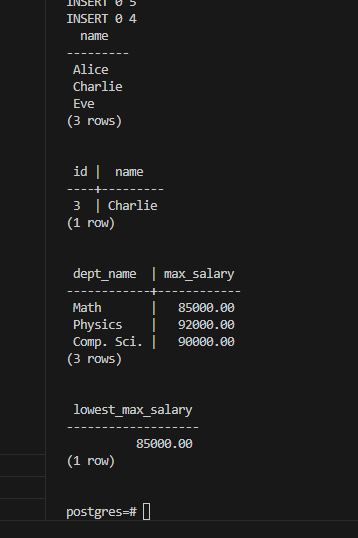
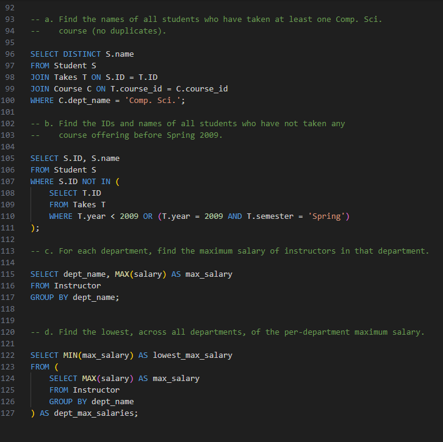

# E3.11DSC-

Write the following queries in SQL using the university schema.

a. Find the names of all students who have taken at least one Comp. Sci. course; make sure there are no duplicate names in the result.

b. Find the IDs and names of all students who have not taken any course offering before Spring 2009.

c. For each department, find the maximum salary of instructors in that department. You may assume that every department has at least one instructor.

d. Find the lowest, across all departments, of the per-department maximum salary computed by the preceding query.

